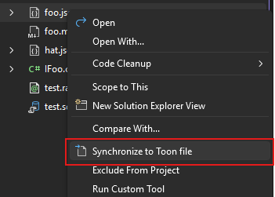
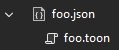
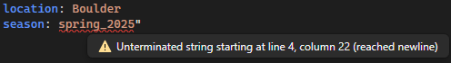

[marketplace]: https://marketplace.visualstudio.com/items?itemName=MadsKristensen.Toon
[vsixgallery]: http://vsixgallery.com/extension/ToonVS.a857d5f5-e2b1-485e-932b-893dbfaf3661/
[repo]:https://github.com/madskristensen/ToonVS

# Toon for Visual Studio

[](https://github.com/madskristensen/ToonVS/actions/workflows/build.yaml)


Download this extension from the [Visual Studio Marketplace][marketplace]
or get the [CI build][vsixgallery]

----------------------------------------

A Visual Studio extension that provides comprehensive support for `.toon` files, including syntax highlighting, error detection, and code generation from JSON files.


Uses the [Toon Tokenizer NuGet package](https://www.nuget.org/packages/ToonTokenizer)

## What is TOON?

TOON (Token-Oriented Object Notation) is a line-oriented, indentation-based format that encodes JSON data with explicit structure and minimal quoting. It's designed to be:

- **More compact than JSON** - Especially for arrays of uniform objects (no repeated keys)
- **LLM-optimized** - Reduces token count for prompts and AI interactions (up to 60% fewer tokens)
- **Human-readable** - Structured like YAML but with deterministic formatting
- **Lossless** - Perfectly round-trips to and from JSON

Perfect for LLM prompts, configuration files, and data interchange where token efficiency and readability matter.

### Example: JSON vs TOON

**JSON** (verbose, repeated keys):
```json
{
  "users": [
    {"id": 1, "name": "Alice", "role": "admin"},
    {"id": 2, "name": "Bob", "role": "user"},
    {"id": 3, "name": "Charlie", "role": "user"}
  ]
}
```

**TOON** (compact, tabular format):
```toon
users[3]{id,name,role}:
  1,Alice,admin
  2,Bob,user
  3,Charlie,user
```

The TOON format eliminates repeated keys in arrays, making it ideal for structured data with uniform objects.

## Features

### Syntax Highlighting
Full syntax highlighting support for `.toon` files that follows the official TOON specification, making it easy to read and edit TOON files directly in Visual Studio. Colors distinguish between property names, values, array definitions, and structural elements.

### JSON to TOON Generator
Automatically encode your JSON files to compact TOON format using the built-in Custom Tool. Simply set the Custom Tool property of a `.json` file to `ToonGenerator`, and Visual Studio will automatically create and maintain a corresponding `.toon` file. Just right-click and hit the command **Synchronize to TOON file**.



This will nest the generated `.toon` file under the source JSON file in Solution Explorer for easy access.



### Error Detection
Real-time syntax validation with inline error messages and warnings displayed in the Error List window. Hover over any error to see detailed information about what went wrong.



### Editor Features
- Line numbers
- Code completion
- Dropdown navigation bars
- Preview support
- Full integration with Visual Studio's editor infrastructure

## Getting Started

### Opening TOON Files
Simply open any `.toon` file in Visual Studio, and the extension will automatically provide syntax highlighting and error detection.

### Generating TOON from JSON
1. Right-click on a `.json` file in Solution Explorer
2. Select **Properties**
3. Set the **Custom Tool** property to `ToonGenerator`
4. Save the file

Visual Studio will automatically encode your JSON to TOON format and nest the generated `.toon` file under your source JSON file. The file stays synchronized whenever you modify the source JSON.

### Use Cases

- **LLM Prompts**: Reduce token count when sending structured data to AI models
- **Configuration Files**: More readable than JSON, more structured than YAML
- **Data Interchange**: Compact format that maintains full JSON compatibility
- **API Responses**: Minimize bandwidth while keeping data human-readable

## Requirements

- Visual Studio 2022 (17.0 or later)
- Supports both x64 and ARM64 architectures

## Learn More

- [TOON Specification](https://github.com/toon-format/spec) - Official format specification
- [ToonTokenizer NuGet Package](https://www.nuget.org/packages/ToonTokenizer) - The .NET library powering this extension
- [Reference Implementation](https://github.com/toon-format/toon) - TypeScript reference implementation


## How can I help?
If you enjoy using the extension, please give it a ★★★★★ rating on the [Visual Studio Marketplace][marketplace].

Should you encounter bugs or have feature requests, head over to the [GitHub repo][repo] to open an issue if one doesn't already exist.

Pull requests are also very welcome, as I can't always get around to fixing all bugs myself. This is a personal passion project, so my time is limited.

Another way to help out is to [sponsor me on GitHub](https://github.com/sponsors/madskristensen).
