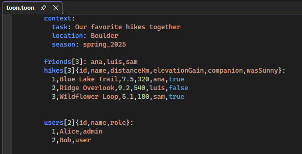

[marketplace]: https://marketplace.visualstudio.com/items?itemName=MadsKristensen.Toon
[vsixgallery]: http://vsixgallery.com/extension/ToonVS.a857d5f5-e2b1-485e-932b-893dbfaf3661/
[repo]:https://github.com/madskristensen/ToonVS

# Toon for Visual Studio

Download this extension from the [Visual Studio Marketplace][marketplace]
or get the [CI build][vsixgallery]

----------------------------------------

A Visual Studio extension that provides comprehensive support for `.toon` files, including syntax highlighting, error detection, and code generation from JSON files.

## What is TOON?

TOON is a tokenized encoding format for JSON that reduces file size while maintaining readability. It's particularly useful for configuration files, data interchange, and scenarios where you want to minimize JSON file size without sacrificing human readability.

## Features

### Syntax Highlighting
Full syntax highlighting support for `.toon` files that follows the official TOON specification, making it easy to read and edit tokenized JSON files directly in Visual Studio.

### Code Generator
Automatically generate `.toon` files from your JSON files using the built-in Custom Tool. Simply set the Custom Tool property of a `.json` file to `ToonGenerator`, and Visual Studio will automatically create and maintain a corresponding `.toon` file. Just right-click and hit the command **Synchronize to TOON file**.

### Error Detection
Real-time syntax validation with inline error messages and warnings displayed in the Error List window. Hover over any error to see detailed information about what went wrong.

### Editor Features
- Line numbers
- Code completion
- Dropdown navigation bars
- Preview support
- Full integration with Visual Studio's editor infrastructure

## Getting Started

### Opening TOON Files
Simply open any `.toon` file in Visual Studio, and the extension will automatically provide syntax highlighting and error detection.

### Generating TOON from JSON
1. Right-click on a `.json` file in Solution Explorer
2. Select **Properties**
3. Set the **Custom Tool** property to `ToonGenerator`
4. Save the file

Visual Studio will automatically generate a `.toon` file nested under your JSON file and keep it synchronized whenever you modify the source JSON.

## Requirements

- Visual Studio 2022 (17.0 or later)
- Supports both x64 and ARM64 architectures

## How can I help?
If you enjoy using the extension, please give it a ★★★★★ rating on the [Visual Studio Marketplace][marketplace].

Should you encounter bugs or have feature requests, head over to the [GitHub repo][repo] to open an issue if one doesn't already exist.

Pull requests are also very welcome, as I can't always get around to fixing all bugs myself. This is a personal passion project, so my time is limited.

Another way to help out is to [sponsor me on GitHub](https://github.com/sponsors/madskristensen).
